# suilens-microservice-tutorial

Microservices tutorial implementation for Assignment 1 Part 2.2.

## Run

```bash
docker compose up --build -d
```

## Migrate + Seed (from host)

```bash
(cd services/catalog-service && bun install --frozen-lockfile && bunx drizzle-kit push)
(cd services/order-service && bun install --frozen-lockfile && bunx drizzle-kit push)
(cd services/notification-service && bun install --frozen-lockfile && bunx drizzle-kit push)
(cd services/catalog-service && bun run src/db/seed.ts)
```

## Smoke Test

```bash
curl http://localhost:3001/api/lenses | jq
LENS_ID=$(curl -s http://localhost:3001/api/lenses | jq -r '.[0].id')

curl -X POST http://localhost:3002/api/orders \
  -H "Content-Type: application/json" \
  -d '{
    "customerName": "Budi Santoso",
    "customerEmail": "budi@example.com",
    "lensId": "'"$LENS_ID"'",
    "startDate": "2025-03-01",
    "endDate": "2025-03-05"
  }' | jq

docker compose logs notification-service --tail 20
```

## API Docs

- Catalog Service Swagger: `http://localhost:3001/swagger`
- Order Service Swagger: `http://localhost:3002/swagger`
- Notification Service Swagger: `http://localhost:3003/swagger`

## Real-Time Notifications

- Notification WebSocket: `ws://localhost:3003/ws/notifications`

## Stop

```bash
docker compose down
```

## DOCS HERE --- __ ---
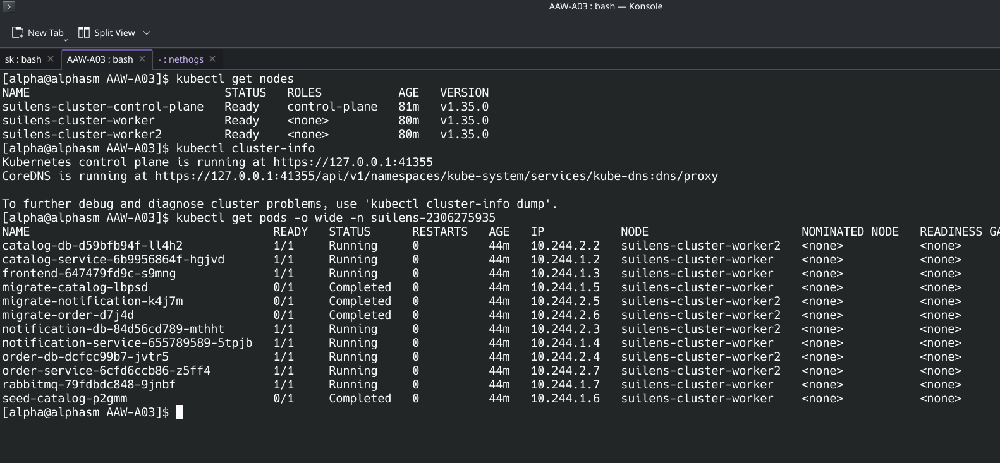

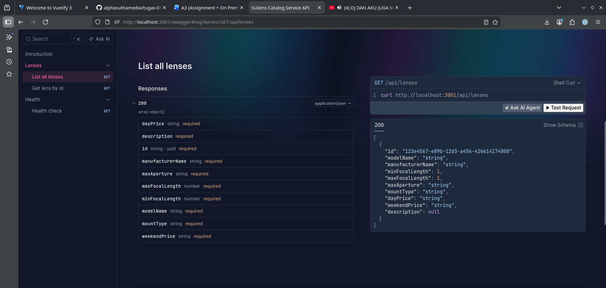
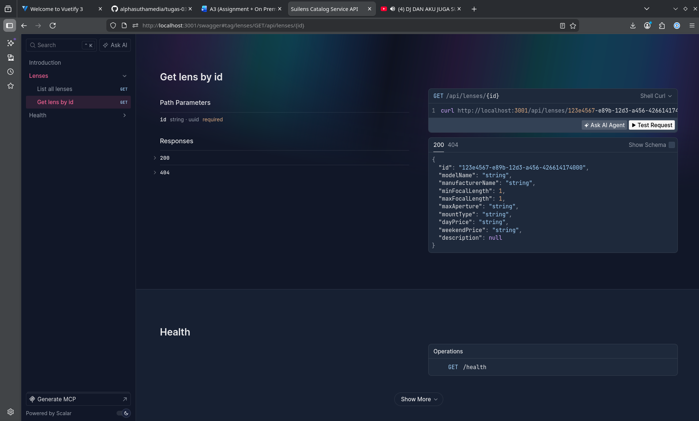
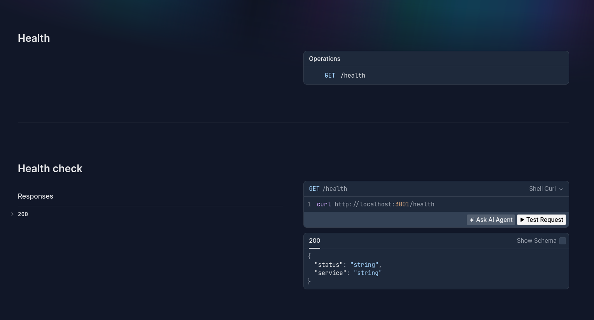

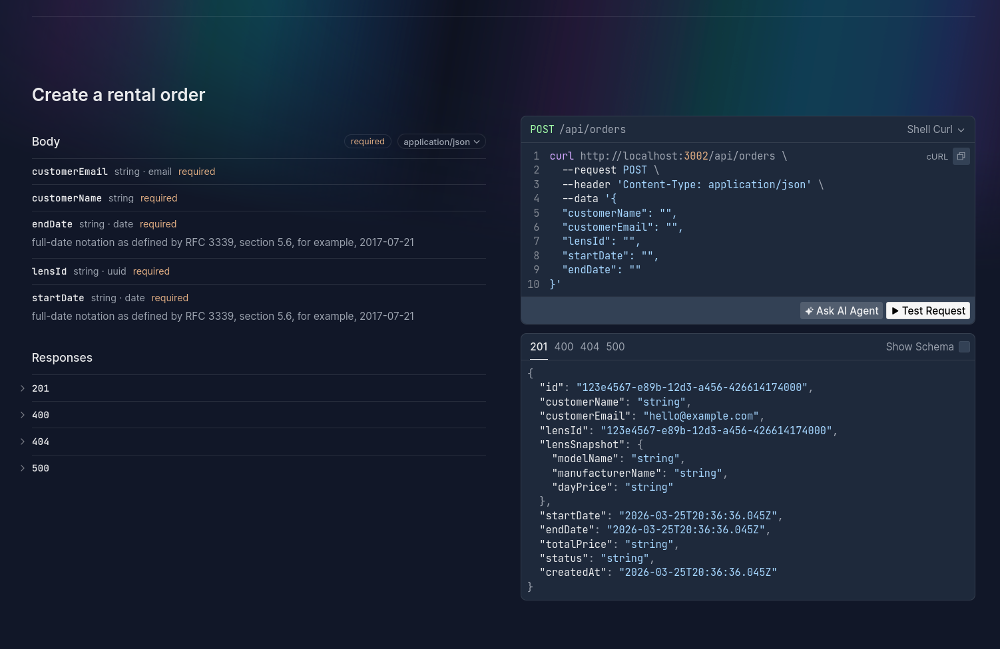
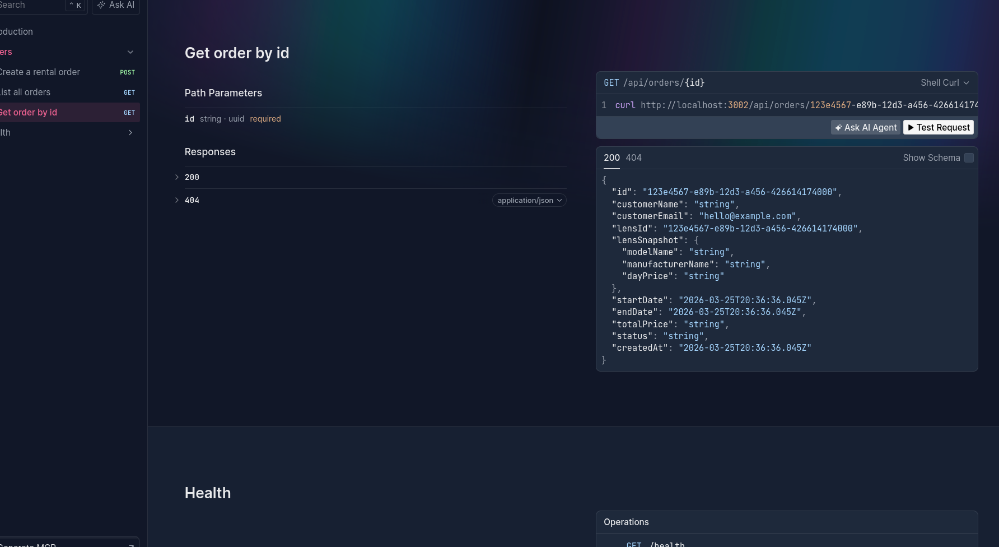
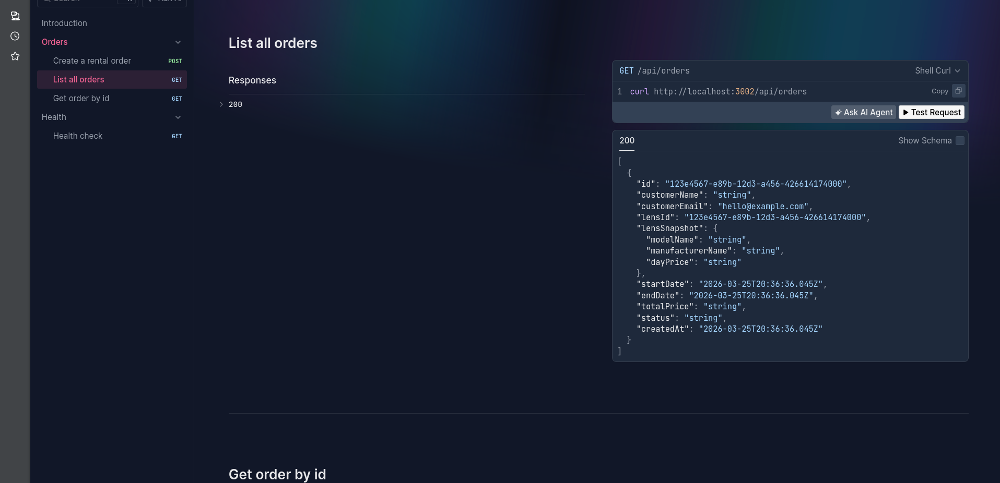
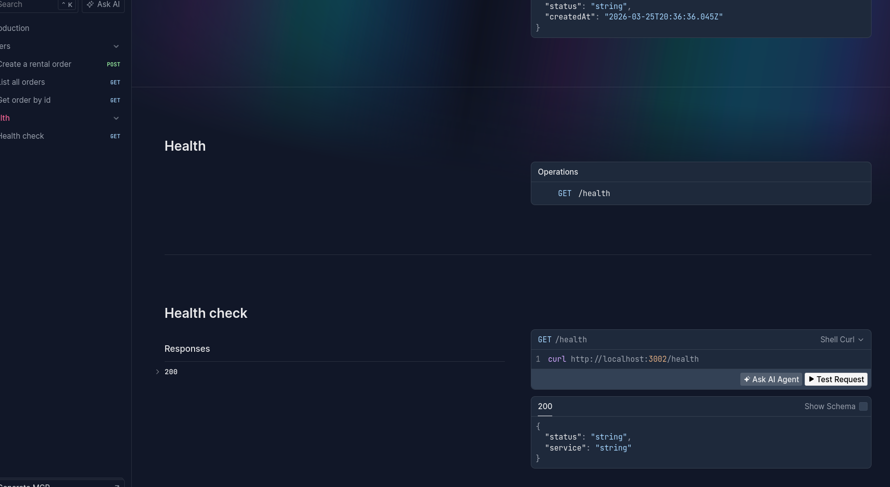

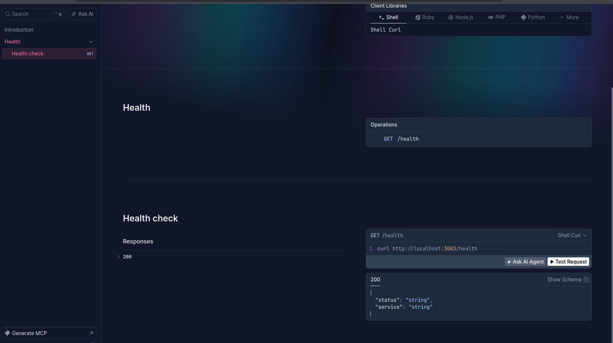

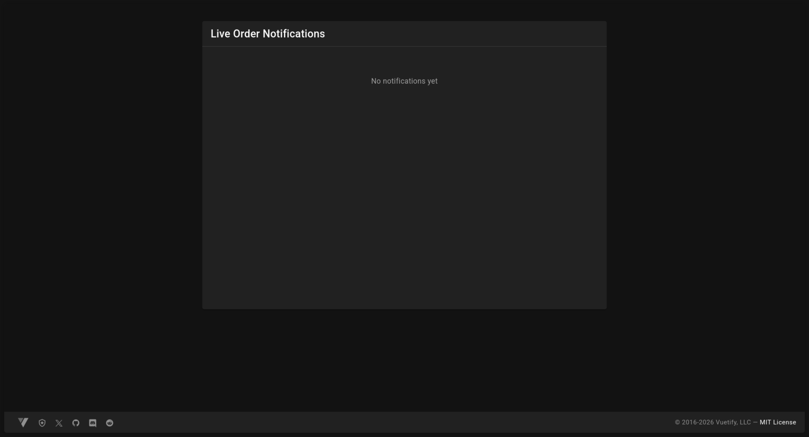
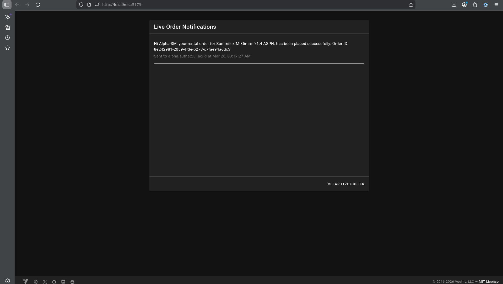

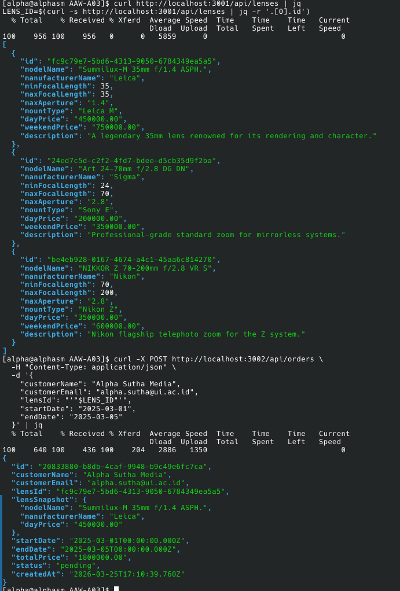

pakai kind karena laptopnya gak kuat kalau harus vm untuk simulasi bebrapa node
